# SmartBuy 电商用户增长与转化分析
> 基于SQL、Python、MySQL与Power BI的电商用户行为分析项目，围绕购买转化问题，完成原始数据处理、数仓分层、业务分析、高潜Session 识别、购买预测与 BI Dashboard 展示。

# 0. Power BI Dashboard

Dashboard 主要设计为三个页面。

## Page 1 — Executive Overview

回答：
> 平台整体经营与购买转化情况如何？

主要展示：
* Total Sessions
* Purchase Sessions
* Conversion Rate
* High Potential Sessions
* Monthly Session Trend
* Monthly CVR
* VisitorType CVR
* Product View Depth CVR

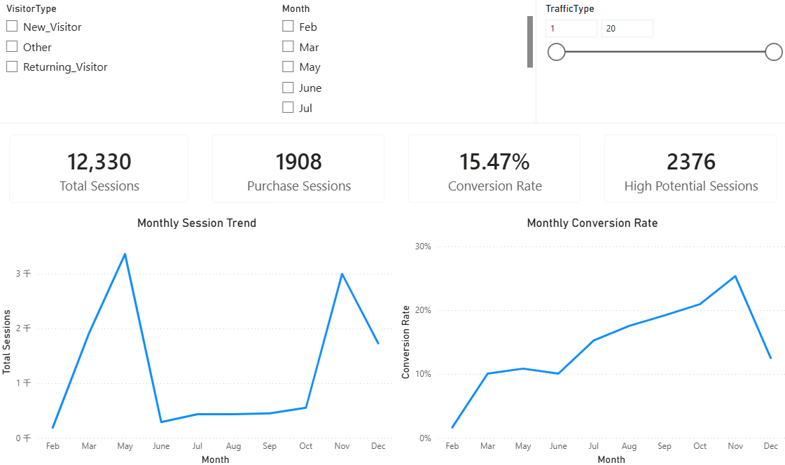

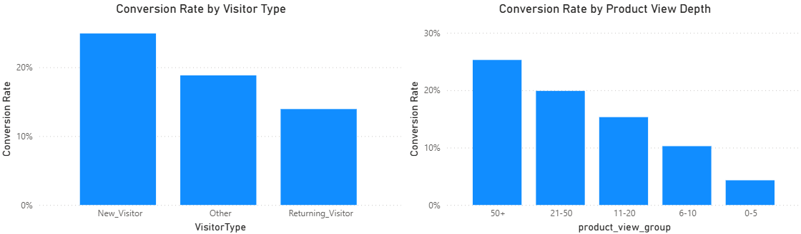

## Page 2 — Behavior & Conversion

回答：
> 哪些Session行为与购买转化存在明显关系？

主要关注：
* ProductRelated
* ProductRelated_Duration
* BounceRates
* ExitRates
* PageValues
* VisitorType
* Session Segment

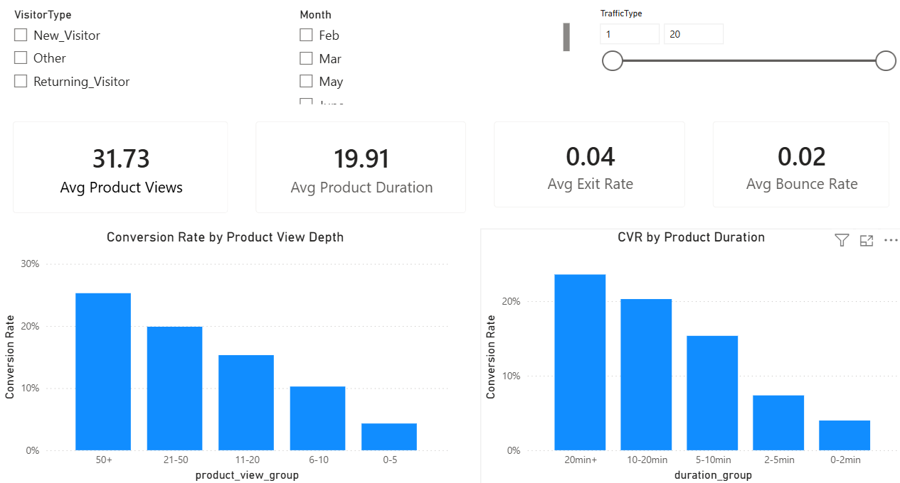

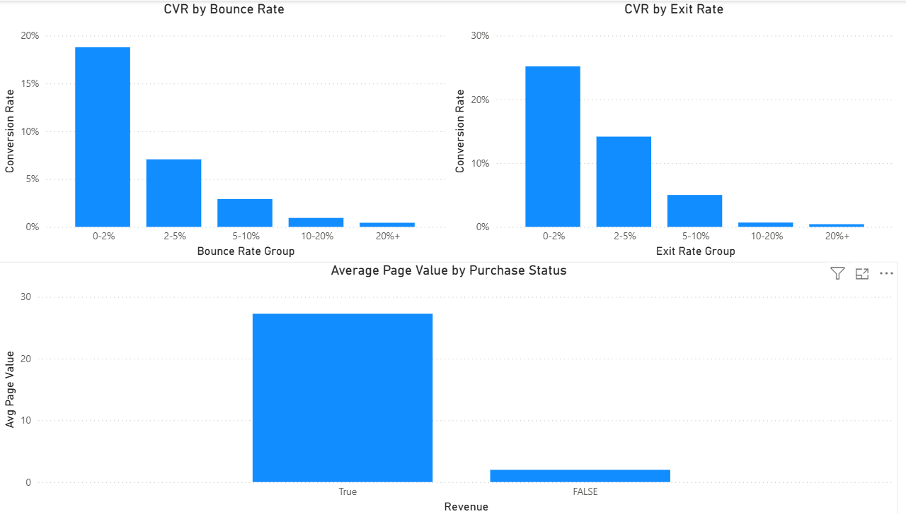

## Page 3 — High Potential Sessions

回答：
> 哪些未购买Session最值得业务进一步关注？

主要展示：
* High Potential Session Volume
* High Potential Rate
* Month Distribution
* TrafficType Distribution
* High Potential Profile
* Session Segment

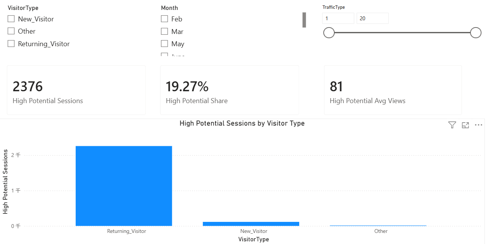

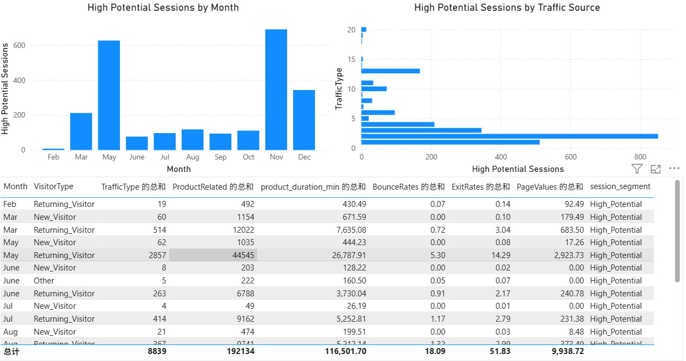

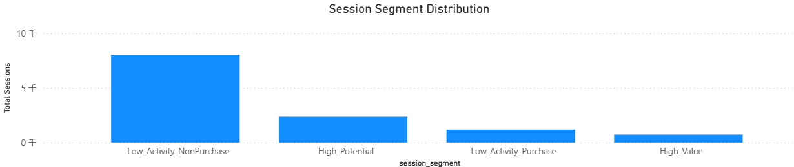

---

# 1. 项目简介

SmartBuy是一个模拟电商平台。

项目背景设定为：平台访问量持续增长，但购买增长相对不足。因此，本项目从用户Session行为数据出发，分析影响购买转化的潜在因素，并重点回答以下问题：
* 平台整体购买转化情况如何？
* 新访客与回访访客的转化表现是否存在差异？
* 商品浏览深度和停留时间与购买行为有什么关系？
* BounceRates、ExitRates、PageValues等指标与购买结果有什么关系？
* 哪些Session已表现出较强购买意向，但最终没有完成购买？
* 如何通过规则和模型进一步识别高潜Session？
* 如何将分析指标沉淀到DWS / ADS，并提供给Power BI使用？

最终形成：
``` text
Raw Data → ODS → DWD → SQL Analysis → Python EDA → Session Segmentation → High Potential Analysis → Purchase Prediction → DWS → ADS → Power BI
```

本项目不仅关注“得到分析结果”，也关注指标口径、数据分层、数据质量和分析结果的工程化沉淀。

---

# 2. 数据集

项目使用**Online Shoppers Purchasing Intention Dataset**。

数据粒度为：
```text
一行 = 一次网站访问Session
```

因此，本项目中的12,330条记录代表**12,330个Session**，而不是12,330个独立用户。

核心数据规模：

| 指标                      |     结果 |
| ----------------------- | -----: |
| Total Sessions          | 12,330 |
| Purchase Sessions       |  1,908 |
| Session Conversion Rate | 15.47% |

主要字段包括：

| 字段                      | 含义                |
| ----------------------- | ----------------- |
| Administrative          | 行政类页面访问次数         |
| Administrative_Duration | 行政类页面停留时间         |
| Informational           | 信息类页面访问次数         |
| Informational_Duration  | 信息类页面停留时间         |
| ProductRelated          | 商品相关页面访问次数        |
| ProductRelated_Duration | 商品相关页面停留时间        |
| BounceRates             | 跳出率               |
| ExitRates               | 退出率               |
| PageValues              | 页面价值              |
| SpecialDay              | 特殊日期指数            |
| Month                   | 访问月份              |
| OperatingSystems        | 操作系统              |
| Browser                 | 浏览器               |
| Region                  | 地区                |
| TrafficType             | 流量类型              |
| VisitorType             | 访客类型              |
| Weekend                 | 是否周末              |
| Revenue                 | 本次 Session 是否最终购买 |

更完整的字段说明见：
```text
docs/data_dictionary.md
```

---

# 3. 技术栈

## 数据处理与分析

* MySQL
* SQL
* Python
* Pandas
* NumPy

## 数据可视化

* Matplotlib
* Power BI

## 机器学习

* Scikit-learn
* Logistic Regression
* Random Forest

## 数据库访问

* SQLAlchemy
* PyMySQL

## 开发环境

* Jupyter Notebook
* MySQL
* Power BI Desktop
* Git / GitHub

---

# 4. 项目架构

项目采用分层数据架构：
```text
CSV
 ↓
ODS
 ↓
DWD
 ↓
DWS
 ↓
ADS
 ↓
Power BI
```

## ODS

ODS层保留原始数据结构，用于承接CSV数据并进行基础数据质量检查。

主要完成：
* 数据导入
* 空值检查
* 重复值检查
* 字段范围检查
* 类别字段检查
* 基础数据质量验证

## DWD

DWD层将原始Session数据进行标准化，并生成业务分析所需的基础衍生字段。

例如：
```text
session_id
Month_Num
VisitorType_Name
is_Weekend
is_Purchase
TotalPage_Views
TotalPage_Duration
ProductView_Ratio
```

DWD保持：
```text
一行 = 一个Session
```
并作为后续SQL、Python和数仓聚合的统一明细数据源。

## DWS

DWS层按照不同业务主题对Session数据进行汇总。

主要包括：
```text
dws_monthly_conversion
dws_visitor_type_conversion
dws_traffic_type_conversion
dws_product_depth_conversion
dws_product_duration_conversion
dws_proxy_funnel
dws_session_segment_summary
```

对应分析：
* 月度经营趋势
* 新老访客转化
* 流量渠道表现
* 商品浏览深度
* 商品停留时长
* 代理行为漏斗
* Session 行为分层

## ADS

ADS面向Dashboard和业务应用输出最终指标。

主要包括：
```text
ads_core_kpi
ads_monthly_dashboard
ads_channel_priority
ads_high_potential_rule
ads_high_potential_profile
```

用于支持：
```text
经营KPI + 月度趋势 + 渠道优先级 + 高潜Session分析 + Power BI Dashboard
```

---

# 5. 项目分析流程

整个项目主要分为以下阶段：
```text
数据理解
   ↓
数据质量检查
   ↓
ODS → DWD
   ↓
SQL业务分析
   ↓
Python EDA
   ↓
交叉分析
   ↓
相关性分析
   ↓
Session分层
   ↓
高潜Session识别
   ↓
Logistic Regression
   ↓
Random Forest
   ↓
规则法 × 模型法
   ↓
DWS / ADS
   ↓
Power BI Dashboard
   ↓
业务结论与建议
```

---

# 6. 核心分析结果

## 6.1 整体经营情况

数据集中共有：
```text
Total Sessions       = 12,330
Purchase Sessions    = 1,908
Conversion Rate      ≈ 15.47%
```
即大约每100个Session中有15个最终产生购买。

---

## 6.2 新访客与回访访客存在明显差异

| VisitorType       | Session | Purchase |    CVR |
| ----------------- | ------: | -------: | -----: |
| New Visitor       |   1,694 |      422 | 24.91% |
| Returning Visitor |  10,551 |    1,470 | 13.93% |
| Other             |      85 |       16 | 18.82% |

其中：
```text
New Visitor CVR       ≈ 24.91%
Returning Visitor CVR ≈ 13.93%
```

虽然Returning Visitor：
* Session 数量更多
* 商品浏览更深
* 商品页面停留时间更长
* 贡献的Purchase Session更多
但其单次Session转化率反而低于New Visitor。

进一步进行：
```text
VisitorType × Product View Depth
```
交叉分析后发现，即使控制商品浏览深度，New Visitor在多个浏览层级中的CVR仍然高于Returning Visitor。


因此：
> VisitorType 本身可能包含额外的购买意向信息，不能仅使用浏览深度解释新老访客之间的转化差异。

---

## 6.3 商品浏览深度与购买转化存在明显正向关联

按照`ProductRelated`对Session进行分组：

| 商品浏览次数 | Session | Purchase |    CVR |
| ------ | ------: | -------: | -----: |
| 0–5    |   2,369 |      102 |  4.31% |
| 6–10   |   1,804 |      185 | 10.25% |
| 11–20  |   2,560 |      392 | 15.31% |
| 21–50  |   3,445 |      685 | 19.88% |
| 50+    |   2,152 |      544 | 25.28% |

可以看到：
```text
4.31%
  ↓
10.25%
  ↓
15.31%
  ↓
19.88%
  ↓
25.28%
```
随着商品浏览深度增加，Session CVR整体持续提高。


从商品浏览次数分布可以看到，购买Session整体表现出更深的商品浏览行为。

同时：
```text
购买Session：
平均商品页访问次数 = 48.21
中位数             = 29

未购买Session：
平均商品页访问次数 = 28.71
中位数             = 16
```
说明购买Session整体表现出更深的商品浏览行为。


> 商品浏览深度与购买意向存在明显正向关联，但该结果属于相关关系，不能直接解释为因果关系。

---

## 6.4 商品页面停留时间与购买转化存在明显关系

按照商品页面停留时间进行分组：

| 商品页停留时间   | Session | Purchase |    CVR |
| --------- | ------: | -------: | -----: |
| 0–2 min   |   2,361 |       94 |  3.98% |
| 2–5 min   |   1,807 |      133 |  7.36% |
| 5–10 min  |   2,006 |      308 | 15.35% |
| 10–20 min |   2,376 |      482 | 20.29% |
| 20+ min   |   3,780 |      891 | 23.57% |


随着商品页面停留时间增加，Session CVR整体呈上升趋势：

转化率表现为：
```text
3.98%
 ↓
7.36%
 ↓
15.35%
 ↓
20.29%
 ↓
23.57%
```
说明商品页面停留时长与购买行为存在较稳定的正向关系。

---

## 6.5 BounceRates / ExitRates与购买结果存在明显差异

### BounceRates

```text
未购买Session Mean = 0.0253
购买Session Mean   = 0.0051
```
购买Session的平均BounceRates约为未购买Session的20%。

### ExitRates

```text
未购买Session Mean = 0.0474
购买Session Mean   = 0.0196
```

整体来看：
> 购买Session表现出更低的BounceRates和ExitRates，说明更强的网站参与行为与最终购买结果存在明显关联。

---

## 6.6 PageValues 是最重要的购买预测信号之一

EDA中：
```text
未购买Session PageValues Mean = 1.976
购买Session PageValues Mean   = 27.265
```

相关性分析得到：

```text
Revenue Correlation

PageValues                 +0.493
ProductRelated             +0.159
ProductRelated_Duration    +0.152
BounceRates                -0.151
ExitRates                  -0.207
```
在当前变量中，PageValues与Revenue的线性相关性明显更强。


相关性分析显示： 
- PageValues与Revenue的相关系数约为+0.493；
- ProductRelated与Revenue呈弱正相关；
- ProductRelated_Duration与Revenue呈弱正相关；
- BounceRates与Revenue呈负相关；
- ExitRates与Revenue呈负相关。
- 其中PageValues与购买结果的线性相关性明显强于其他几个核心行为变量。

> 相关性只能说明统计关联，不能直接解释为因果关系。

因此在建模阶段进一步进行了的A/B对比:

```text
Model A：包含PageValues
Model B：不包含PageValues
```

---

# 7. 高潜Session分析

## 7.1 为什么分析高潜Session？

仅分析已经购买的Session并不能直接形成运营机会。

因此，本项目进一步关注以下Session：

```text
行为已经很深 + 表现出较强购买意向 + 最终没有购买
```

由于原始数据没有真实`user_id`，因此这里严格称为：
> High Potential Sessions
而不是High Potential Users。

---

## 7.2 P75高浏览规则

首先使用`ProductRelated`的数据分布确定浏览深度阈值：
```text
ProductRelated P75 = 38
```

因此定义：
```text
ProductRelated >= 38
AND
Revenue = False
```
为规则法高潜未购买Session。

该规则识别出：
```text
2,376 High Potential Sessions
```

进一步分析发现，这些Session并不是快速跳出或低参与Session。

相反，它们表现出：
```text
更深的商品浏览 + 更长的商品停留时间 + 更低的BounceRates + 更低的ExitRates + 更高的PageValues + 最终仍未购买
```
其中商品页面平均停留时间约为全部未购买Session的**2.75倍**。

> 因此，高浏览未购买群体值得进一步区分，而不能简单视为普通流失流量。

---

# 8. 购买预测模型

为了进一步识别单一浏览规则无法发现的购买倾向，本项目使用：
```text
Logistic Regression + Random Forest
```
进行轻量购买预测。

模型目标不是构建复杂机器学习系统，而是回答：
> 多维Session行为特征能否帮助我们进一步识别高购买倾向Session？

---

## 8.1 Logistic Regression

Logistic Regression作为可解释Baseline。

同时为了验证模型是否过度依赖`PageValues`，进行了两组实验：
```text
Model A
包含 PageValues

vs

Model B
删除 PageValues
```

结果：
```text
ROC-AUC

With PageValues       ≈ 0.8695
Without PageValues    ≈ 0.6679
```


在保持训练集、测试集、算法及其他特征一致的情况下： 
- 包含PageValues：ROC-AUC ≈ 0.8695
- 删除PageValues：ROC-AUC ≈ 0.6679
- ROC-AUC差异：≈ 0.2016
- 说明当前模型的购买区分能力明显依赖PageValues。

同时需要注意，在实际业务部署前需要确认 PageValues 在预测发生时是否已经可获得，避免潜在的数据泄漏问题。


混淆矩阵用于观察模型对购买和未购买 Session 的分类结果：
- TN：实际未购买，模型预测未购买
- FP：实际未购买，模型预测购买
- FN：实际购买，模型预测未购买
- TP：实际购买，模型预测购买

对于高潜Session识别场景，需要特别关注FN，因为FN越多，意味着模型遗漏的真实购买Session越多。


Logistic Regression的ROC曲线明显高于随机分类基准线，说明模型对购买和未购买Session具有较好的整体区分能力。 

> ROC-AUC衡量模型整体排序与区分能力，而Recall受到最终分类阈值影响，因此较高的ROC-AUC与某一阈值下较低的Recall并不矛盾。

---

## 8.2 Random Forest

Random Forest 用于补充验证：
```text
非线性关系 + 变量交互 + Feature Importance
```


主要Feature Importance：
| Feature                 | Importance |
| ----------------------- | ---------: |
| PageValues              |     0.4288 |
| ExitRates               |     0.1253 |
| ProductRelated_Duration |     0.1244 |
| ProductRelated          |     0.0869 |
| BounceRates             |     0.0704 |
PageValues再次排名第一。

因此形成了一条相对完整的证据链：
```text
EDA
↓
PageValues与Revenue相关性最高

Logistic Regression A/B
↓
删除PageValues后ROC-AUC明显下降

Random Forest
↓
PageValues Feature Importance排名第一
```

---

# 9. 规则法 × 模型法高潜识别

单一规则存在明显局限：
```text
浏览很多 ≠ 一定具有最高购买倾向
```

因此进一步将：
```text
P75浏览规则 + 模型Top 10%购买倾向
```
进行交叉。

最终形成：
```text
Rule Only
Model Only
Both
Neither
```

其中：
### Rule Only

```text
2,188 Sessions
```
表现出较深浏览行为，但模型综合购买倾向没有进入Top 10%。

### Model Only

```text
168 Sessions
```

平均商品浏览仅约：
```text
23.34
```

但：
```text
PageValues ≈ 43.22
模型购买倾向 ≈ 0.946
```
说明模型能够识别一部分无法通过“高浏览”单一规则发现的潜在购买Session。

### Both

```text
188 Sessions
```

同时满足：
```text
P75高浏览 + Model Top 10% + 最终未购买
```

定义为：
> Core High Potential Sessions

这一群体平均：
```text
ProductRelated          ≈ 130.80
ProductRelated_Duration ≈ 88.2 min
Purchase Propensity     ≈ 0.935
```

同时具有：
```text
极深商品浏览 + 超长停留 + 低BounceRates + 低ExitRates + 较高PageValues + 高模型购买倾向 + 最终未购买
```

因此，这188个Session是当前数据下最值得进一步研究的核心高潜群体。

---

# 10. 模型阈值与业务目标

分类模型不能机械使用：
```text
threshold = 0.5
```

本项目进一步比较不同分类阈值。

当前测试中：
```text
threshold = 0.2
```
取得较高F1，并将Recall从约：
```text
32.98%
```
提高至：
```text
60.99%
```

因此模型阈值应该根据运营成本进行选择。


随着分类阈值提高，Precision整体提高，而Recall下降，体现出典型的Precision-Recall Trade-off。

### 低成本触达

例如：
```text
Email
Push
站内推荐
```
可以适当降低阈值，提高Recall，覆盖更多潜在购买Session。

### 高成本触达

例如：
```text
优惠券
人工销售
高成本营销资源
```
则应该更加关注Precision，避免大量无效触达。

---

# 11. Session运营分层

结合规则法与模型法，可以进一步建立三级未购买Session运营体系：

| 优先级 | Session                    |    数量 | 建议                      |
| --- | -------------------------- | ----: | ----------------------- |
| P1  | Core High Potential / Both |   188 | 优先分析转化阻碍，重点触达           |
| P2  | Model Only                 |   168 | 模型高意向群体，精准触达            |
| P3  | Rule Only                  | 2,188 | 高参与但购买信号相对较弱，低成本运营或继续观察 |

核心思想是：
> 不应该把所有“浏览很多但没有购买”的Session看作同样高价值，而应该结合浏览、停留、退出、PageValues和模型评分等多维信息进一步确定优先级。

---

# 12. Proxy Funnel

由于原始数据是Session级聚合数据，没有以下链条的完整事件时间序列，因此项目没有人为构造不存在的标准电商漏斗。

```text
view
↓
product_detail
↓
add_cart
↓
checkout
↓
payment
↓
purchase
```


而是根据Session行为特征构建：

> Proxy Funnel / 代理行为漏斗

例如：
```text
All Sessions
↓
Product View
↓
Deep Product View
↓
Purchase
```
因此，该漏斗用于辅助观察行为深度变化，而不等同于真实埋点事件漏斗。

如果未来获得事件级数据，可以进一步构建标准漏斗，如下：
```text
View → Product Detail → Add Cart → Checkout → Payment → Purchase
```

# 13. Power BI Interactive Analysis Examples

## 13.1 User Segment Analysis（用户分群分析）

* 目的：
通过VisitorType筛选，分析不同用户群体的购买行为差异。

业务问题：
```text
不同类型用户是否具有不同的购买意愿？
```

### Case 1：不同访客类型的转化差异分析

筛选条件:
* VisitorType：New Visitor
* Month：All
* TrafficType：All

观察：
* Avg Product Views
* Avg Product Duration
* CVR by Product View Depth
* CVR by Product Duration
* CVR by Bounce Rate
* CVR by Exit Rate

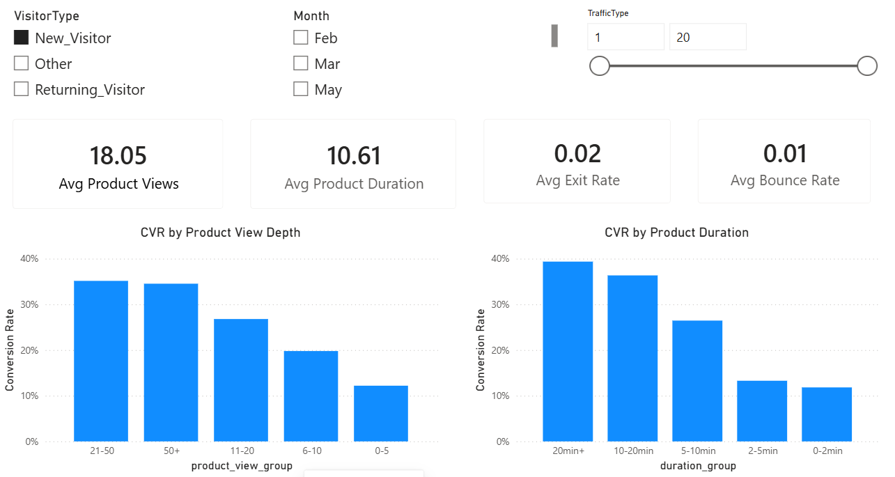

结论
> New Visitor在整体浏览深度和停留行为方面表现较强，平均浏览商品数量为18.05，平均停留时间为10.61。随着Product View Depth和Product Duration增加，该用户群体的 Conversion Rate呈现明显提升趋势，说明浏览参与程度与购买行为存在较强关联。相比低参与度Session，高浏览深度和长停留时间的新访客更值得进行后续转化运营。
> 该分析帮助运营人员识别高参与度新用户群体，并通过浏览深度和停留时间判断潜在购买意向。

### Case 2：比较同一月份不同访客类型表现

业务问题：
```text
5月份，新访客和老访客谁更容易购买？
```

第一次筛选：
* Month：May
* TrafficType：All
* VisitorType：New Visitor


第二次筛选：
* Month：May
* TrafficType：All
* VisitorType：Returning Visitor

查看：
* CVR
* Avg Product Views
* Duration

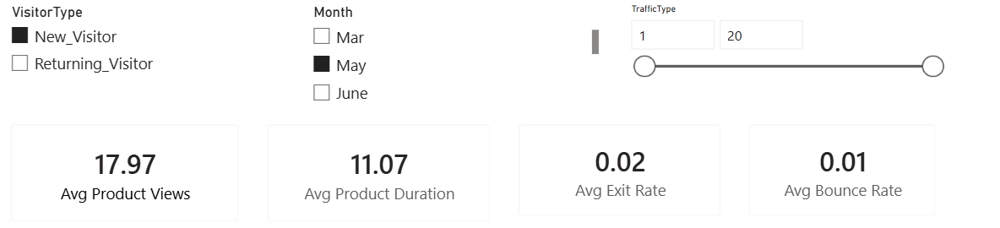

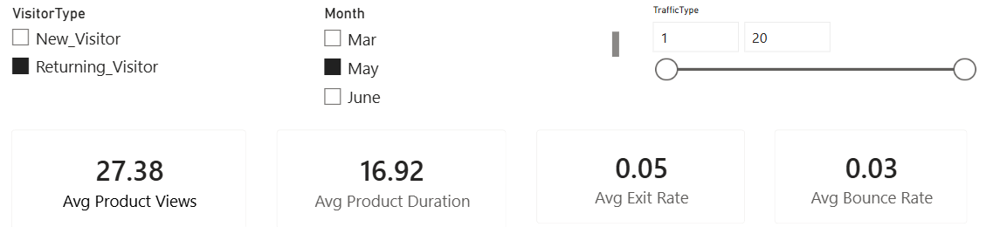

结论：
> 在May月份，New Visitor平均浏览商品数量为17.97，平均商品页面停留时间为11.07；Returning Visitor平均浏览商品数量提升至27.38，平均停留时间达到16.92。相比New Visitor，Returning Visitor表现出更深的浏览行为和更高的网站参与度，但同时具有更高的Exit Rate（0.05 vs 0.02）和Bounce Rate（0.03 vs 0.01），说明老访客虽然对商品具有更强兴趣，但部分用户仍可能在购买决策阶段流失。
> 该分析说明不同访客类型在购买路径中扮演不同角色。

### Case 3：寻找最值得运营的新用户群体

筛选条件：
VisitorType：New Visitor
Month：November
TrafficType：2

查看：
* CVR
Product View Depth
Duration

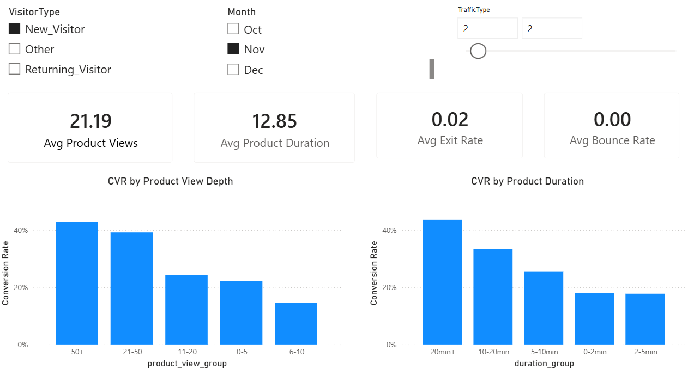

结论：
> November月份来自TrafficType 2的New Visitor表现出较高的用户参与度，平均商品浏览次数为21.19，平均商品页面停留时间为12.85。从转化趋势来看，随着浏览深度增加，Conversion Rate明显提升，其中浏览50+个商品页面的用户转化率超过40%；同时，停留时间超过20分钟的用户转化率最高，约为44%。该群体具有较强的浏览意愿和购买潜力，是值得重点关注的新用户群体。
> November的TrafficType 2新访客已经表现出较强购买兴趣，可通过精准推荐、优惠券或首次购买激励促进其完成转化。

## 13.2 Time & Channel Performance Analysis（时间与渠道分析）

* 目的：
通过Month和TrafficType筛选，分析不同时间、来源渠道的流量质量。

业务问题：
```text
哪些月份、哪些渠道带来的用户价值更高？
```

### Case 4：月份维度下的转化趋势分析

筛选条件：
* VisitorType：All
* Month：November
* TrafficType：All

查看：
* Session数量
* Purchase数量
* CVR by Product View Depth
* CVR by Visitor Type

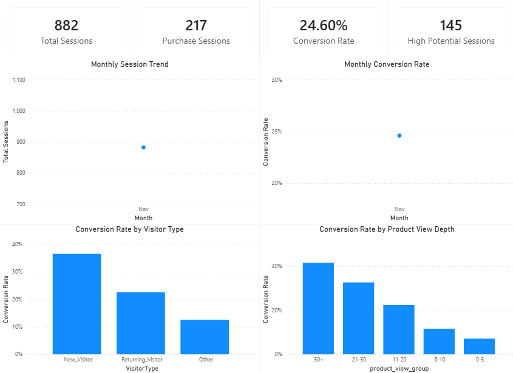

结论：
> 在November月份，平台共获得882个Session，其中217个Session完成购买，整体Conversion Rate达到24.60%。从用户结构来看，New Visitor的转化率最高，约为36%，高于Returning Visitor（约22%）；同时，随着商品浏览深度增加，用户转化率明显提升，其中浏览50+个商品页面的用户Conversion Rate超过40%。说明November期间平台流量质量较高，高参与度用户具有更强的购买倾向。
> November是高价值转化月份，应重点关注高浏览深度用户和新访客群体，通过精准推荐和营销激励进一步提升订单转化。

### Case 5：5月新访客在某渠道中的购买表现

筛选条件：
* VisitorType：New Visitor
* Month：May
* TrafficType：4

查看：
* Avg Product Views
* Avg Product Duration
* Avg Bounce Rate
* Avg Exit Rate
* CVR by Product View Depth
* CVR by Product Duration

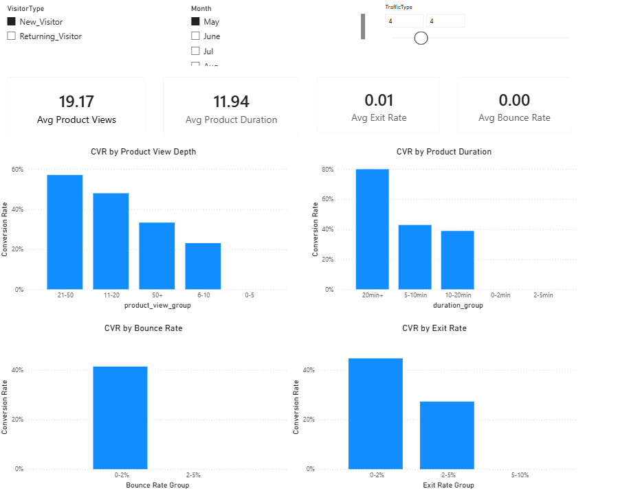

结论：
> 在May月份，TrafficType4带来的 New Visitor 表现出较高的用户参与度，平均商品浏览次数为19.17，平均商品页面停留时间为11.94。从转化行为来看，随着商品浏览深度增加，用户Conversion Rate明显提升，其中21-50次商品浏览用户转化率最高，接近60%；同时，停留时间超过20分钟的用户转化率达到约80%。此外，该群体整体Exit Rate（0.01）和Bounce Rate（接近 0）较低，说明TrafficType 4获取的新用户具有较强浏览意愿和较高购买潜力。
> May月份TrafficType 4是高质量新用户来源渠道，应针对该渠道用户加强商品推荐和首次购买激励，提高高意向访客转化率。

### Case 6：11月回访用户来自高流量渠道的转化分析

筛选条件:
* VisitorType：Returning Visitor
* Month：November
* TrafficType：2

查看：
* Session数量
* Conversion Rate
* Product View Depth
* Duration

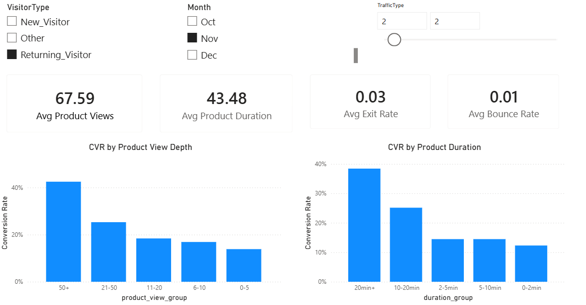

结论：
> November月份TrafficType 2渠道下的Returning Visitor表现出较高的用户参与度，平均商品浏览次数达到67.59，平均商品页面停留时间达到43.48，说明该渠道用户具有较强的商品探索行为。从转化趋势来看，随着浏览深度增加，Conversion Rate持续提升，其中浏览50+个商品页面的用户转化率超过40%；同时停留时间超过20分钟的用户转化率最高，约为38%。虽然该群体存在一定Exit Rate（0.03），但整体浏览深度和停留时长较高，表明TrafficType 2能够带来高参与度的回访用户。
> TrafficType 2是高价值回访用户的重要来源，应针对该渠道加强个性化推荐和召回策略，减少用户在购买决策阶段的流失。

### Case 7：分析某渠道的新用户质量

筛选条件：
* VisitorType：New Visitor
* Month：August
* TrafficType：2

查看：
* Bounce Rate
* Exit Rate
* Product Duration
* Conversion Rate

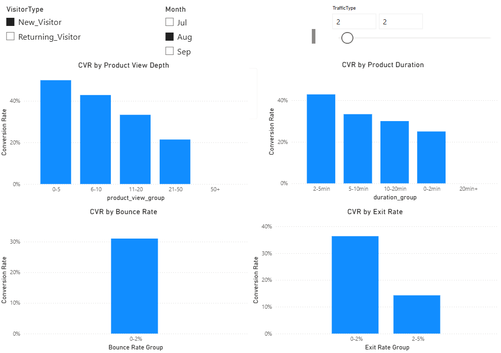

结论：
> August月份TrafficType 2获取的新用户表现出较好的参与度和转化潜力。该群体在不同浏览深度下均表现出较高的Conversion Rate，其中0-5次商品浏览用户转化率最高，约为50%；随着商品浏览深度增加，转化率整体仍保持较高水平。同时，商品停留时间在2-5分钟时达到最高转化率，约为42%。此外，该渠道用户的Bounce Rate和Exit Rate主要集中在较低区间（0-2%），说明TrafficType 2带来的新用户整体流失较少，用户质量较高。
> August月份TrafficType 2是质量较高的新用户来源渠道，应持续投入渠道优化，并通过个性化推荐和首购激励促进用户完成转化。

## 13.3 High Potential Session Analysis（高潜用户分析）

* 目的：
发现已经表现出购买兴趣，但是最终没有购买的Session。

### Case 8：高浏览深度用户为什么没有购买

筛选条件：
* VisitorType：Returning Visitor
* Month：November
* TrafficType：2
* Revenue：False

查看：
* High Potential Count
* Product Views
* Duration

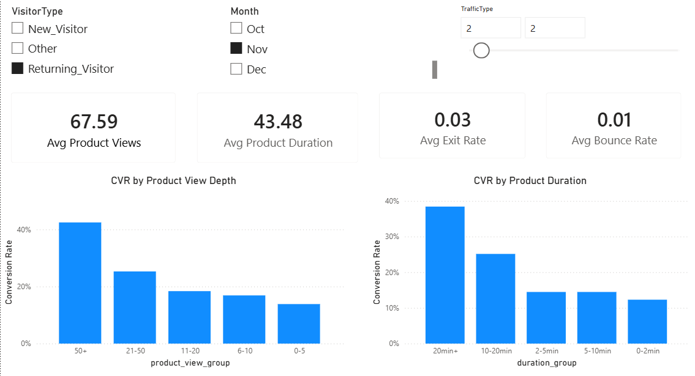

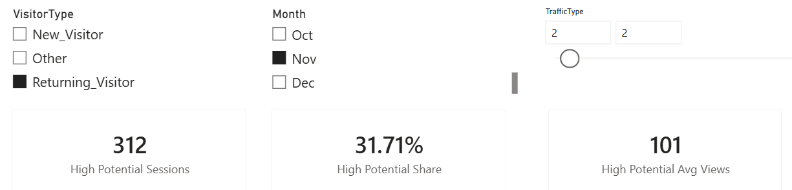

结论：
> November月份TrafficType 2的Returning Visitor中，共识别出312个High Potential Sessions，High Potential Share达到31.71%，平均商品浏览次数达到101次。该群体表现出非常高的商品探索深度，同时平均商品浏览深度越高，Conversion Rate越明显提升，其中浏览50+个商品页面的用户转化率超过40%；停留时间超过20分钟的用户转化率也达到约38%。然而，这些Session最终未完成购买，说明用户已经表现出较强购买兴趣，但仍存在购买决策阶段的阻碍。
> 该群体属于高意向但未转化用户，应优先通过个性化推荐、优惠激励或购物提醒等方式降低购买阻碍，提升潜在订单转化。

### Case 9：核心高潜用户定位

筛选条件：
* VisitorType：Returning Visitor
* Month：November
* TrafficType：2
* Session Segment：Both

查看：
* Session Count
* Avg Product Views
* Avg Duration
* Purchase Probability

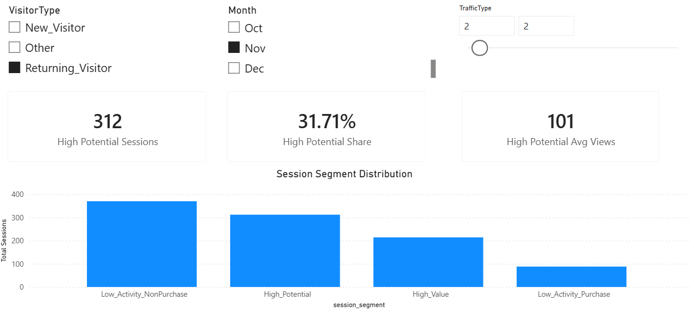

结论：
> 在November月份TrafficType 2的Returning Visitor中，共识别出312个High Potential Sessions，占该筛选范围Session的31.71%，平均商品浏览次数达到101次。从Session Segment分布来看，High Potential用户占据较大比例，同时仍存在大量Low Activity NonPurchase用户。该结果表明，部分回访用户已经表现出较高的商品兴趣和浏览深度，但尚未完成购买，其中高潜用户是最值得优先关注的运营对象。
> 应优先针对High Potential Session进行精准触达，通过个性化推荐、优惠激励或召回策略，将高购买意向但未转化用户转化为实际订单。

---

# 14. 核心业务结论

本项目最终得到以下主要结论：

1. **商品浏览深度与购买转化存在明显正向关联。** CVR从0–5次浏览组的4.31%提升至50+浏览组的25.28%。

2. **商品页面停留时间与购买转化同样存在较稳定的正向关系。** CVR从0–2分钟组的3.98%提升至20分钟以上组的23.57%。

3. **购买 Session整体具有更低的BounceRates和ExitRates。** 网站参与程度与最终购买结果存在明显关联。

4. **New Visitor与Returning Visitor存在明显转化差异。** New Visitor CVR约为24.91%，Returning Visitor约为13.93%，且该差异不能仅通过浏览深度解释。

5. **PageValues是当前数据中最重要的购买预测信号之一。** 删除该变量后Logistic Regression ROC-AUC从约0.8695降至0.6679；Random Forest中其Feature Importance同样排名第一。

6. **单一浏览规则无法完整识别高购买倾向Session。** 模型识别出了168个Model Only Session，这些Session浏览次数不高，但PageValues和综合购买倾向明显较高。

7. **规则法和模型法共同识别出的188个Both Session是当前最值得关注的Core High Potential Sessions。**

8. **模型分类阈值应服务于业务目标。** 低成本触达更关注Recall，高成本触达则应更加重视Precision。

---

# 15. 业务建议

## 15.1 建立分层运营机制

针对未购买Session，不建议使用统一运营策略。

可以根据以下方式建立P1 / P2 / P3分层：
```text
规则高潜 + 模型高潜
```
优先将分析和运营资源投入Core High Potential Sessions。

## 15.2 深挖Core High Potential的真实流失原因

当前数据能够发现：
> 哪些Session值得关注。

但无法准确回答：
> 为什么它们最终没有购买。

建议未来补充这些等事件和业务数据：
* Add to Cart
* Checkout
* Payment
* Coupon / Promotion
* Price
* Inventory
* Product
* Category

进一步定位真实转化阻碍：
```text
商品问题
价格问题
优惠问题
库存问题
支付问题
页面体验问题
```

## 15.3 渠道评估同时考虑规模与效率

渠道不能只看CVR，也不能只看Session数。

建议综合考虑，再进行营销资源分配。
```text
Session Volume + Conversion Rate + High Potential Volume + High Potential Rate + Marketing Cost + Expected Revenue
```

## 15.4 根据触达成本调整模型阈值

对于Email、Push等低成本触达，可以提高Recall。

对于优惠券、人工销售等高成本触达，应更加关注Precision。

---

# 16. 数据质量与指标一致性

项目不仅进行了分析，也对数据链路进行了质量校验。

主要包括：

### ODS

* 数据量检查
* 空值检查
* 重复值检查
* 字段范围检查
* 类别值检查

### DWD

* Session ID唯一性
* 页面访问次数非负
* Duration非负
* 比例字段范围检查
* Month标准化检查
* Revenue → is_purchase映射检查

### DWD → DWS

验证：
```text
SUM(DWS session_cnt) = DWD Total Sessions
```

以及：
```text
SUM(DWS purchase_cnt) = DWD Purchase Sessions
```

### DWS → ADS

继续进行指标对账，保证Dashboard使用的数据与底层数据口径一致。

通过以下方式减少因为多层加工造成的指标口径不一致。
```text
数据质量检查 + 层间对账 + 统一指标定义
```

---

# 17. 项目目录

```text
ecommerce-user-analysis/
│
├── data/
│   ├── raw/
│   │   └── online_shoppers_intention.csv
│   └── processed/
│
├── sql/
│   ├── 01_create_database.sql
│   ├── 02_data_quality.sql
│   ├── 03_create_dwd.sql
│   ├── 04_dwd_quality.sql
│   ├── 05_business_analysis.sql
│   └── 06_dws_ads_etl.sql
│
├── python/
│   ├── 01_data_exploration.ipynb
│   ├── 02_business_eda.ipynb
│   ├── 03_user_segmentation_model.ipynb
│   ├── 04_dws_ads_etl.ipynb
│   └── 05_powerbi_dashboard_prep.ipynb
│
├── docs/
│   ├── data_dictionary.md
│   └── analysis_report.md
│
├── dashboard/
│   └── [Power BI 文件]
│
├── images/
│   ├── 02/
│   ├── 03/
│   └── dashboard/
│
└── README.md
```

> 如果你的实际Notebook或Power BI文件名不同，请按照本地项目目录修改。

---

# 18. 如何运行项目

## Step 1：准备MySQL

创建数据库：
```sql
CREATE DATABASE ecommerce_analysis;
```
并完成原始CSV数据导入。

---

## Step 2：执行 SQL

按照顺序运行：
```text
01_create_database.sql
        ↓
02_data_quality.sql
        ↓
03_create_dwd.sql
        ↓
04_dwd_quality.sql
        ↓
05_business_analysis.sql
        ↓
06_dws_ads_etl.sql
```

完成：
```text
ODS
↓
DWD
↓
DWS
↓
ADS
```
的数据处理链路。

---

## Step 3：运行Python Notebook

建议按照：
```text
01_data_exploration.ipynb
        ↓
02_business_eda.ipynb
        ↓
03_user_segmentation_model.ipynb
        ↓
04_dws_ads_etl.ipynb
        ↓
05_powerbi_dashboard_prep.ipynb
```
依次运行。

每个Notebook均按照独立运行方式设计，需要重新执行对应的：

```python
import ...
```
以及数据读取、数据库连接等初始化代码，不依赖前一个Notebook的内存变量。

---

## Step 4：连接Power BI

Power BI优先读取ADS / Dashboard准备数据，而不是重新从原始CSV计算全部指标。

推荐链路：
```text
MySQL
 ↓
DWS / ADS
 ↓
Power BI
 ↓
Dashboard
```

---

# 19. 项目亮点

### 1. 完整数据分析链路

项目不是单纯使用Pandas画图，而是完成如下完整流程：

```text
数据导入 → 数据质量 → 数仓分层 → SQL分析 → Python EDA → 用户分层 → 预测模型 → DWS / ADS → Power BI
```


### 2. SQL与 Python分工明确

```text
SQL → 数据处理、指标计算、业务聚合

Python → EDA、分布分析、交叉验证、建模

Power BI → 指标展示与业务监控
```

### 3. 同时关注规模与效率

分析中不只比较：
```text
Session Count
```

也同时比较：
```text
Purchase Count
Conversion Rate
High Potential Rate
```

避免单一指标造成错误判断。

### 4. 规则法与模型法结合

不仅使用如下业务规则：
```text
ProductRelated >= P75
```

也使用机器学习购买倾向评分补充识别单一规则遗漏的Session。

### 5. 强调数据口径与严谨性

项目中明确区分：
```text
Session ≠ User
相关性 ≠ 因果关系
Proxy Funnel ≠ Event Funnel
Prediction Score ≠ 真实购买概率
```

避免为了项目展示而过度解释数据。

### 6. 数据分析与数据开发结合

通过：
```text
ODS → DWD → DWS → ADS
```

将分析过程中验证过的指标进一步工程化，为PowerBI 提供稳定的数据源。

---

# 20. 项目局限性

本项目仍存在以下限制：

1. 数据粒度是Session，不是独立User，因此无法进行真正的用户生命周期分析。
2. 数据缺少`user_id`，无法识别同一用户的多次访问。
3. 数据缺少完整事件时间序列，因此无法构建标准电商事件漏斗。
4. 缺少Add to Cart、Checkout、Payment等关键转化事件。
5. 缺少商品价格、优惠、库存、物流等业务变量。
6. PageValues对模型贡献较大，实际部署前需要确认该字段在预测时点是否已经可获取，避免数据泄漏风险。
7. `predict_proba()`在当前项目中主要作为购买倾向评分，不应直接解释为经过校准的真实购买概率。
8. 当前分析主要用于发现相关关系和预测关系，不能直接证明因果关系。

---

# 21. 后续优化方向

未来可以进一步升级：

```text
事件级用户行为数据
        ↓
标准电商漏斗
        ↓
用户级行为宽表
        ↓
RFM / 用户生命周期
        ↓
商品 / 品类分析
        ↓
优惠券 / 营销归因
        ↓
模型评分落库
        ↓
定时ETL
        ↓
Power BI自动刷新
```

同时可以进一步增加：

* Airflow / DolphinScheduler调度
* 增量ETL
* 数据分区
* 数据质量监控
* 模型评分表
* Out-of-Fold Prediction
* Probability Calibration
* SHAP模型解释
* A/B Test
* 营销ROI分析

---

# 22. 项目总结

本项目围绕“为什么大量Session没有最终完成购买”这一业务问题，从原始用户行为数据出发，完成了：

```text
数据处理 + SQL业务分析 + Python EDA + 用户行为分层 + 高潜Session识别 + 购买倾向预测 + DWS / ADS指标沉淀 + Power BI Dashboard
```

分析结果显示，商品浏览深度、商品页面停留时间、BounceRates、ExitRates、PageValues以及VisitorType均与购买行为表现出不同程度的关联。

在此基础上，项目进一步将P75高浏览规则与模型Top 10%购买倾向进行交叉，识别出 **188个Core High Potential Sessions**，用于模拟更加精细化的运营优先级划分。

整个项目重点不仅是“分析数据”，还尝试完成以下的完整数据分析闭环：

```text
发现问题
↓
分析问题
↓
验证问题
↓
识别机会
↓
形成指标
↓
沉淀数据层
↓
Dashboard展示
↓
支持业务决策
```


