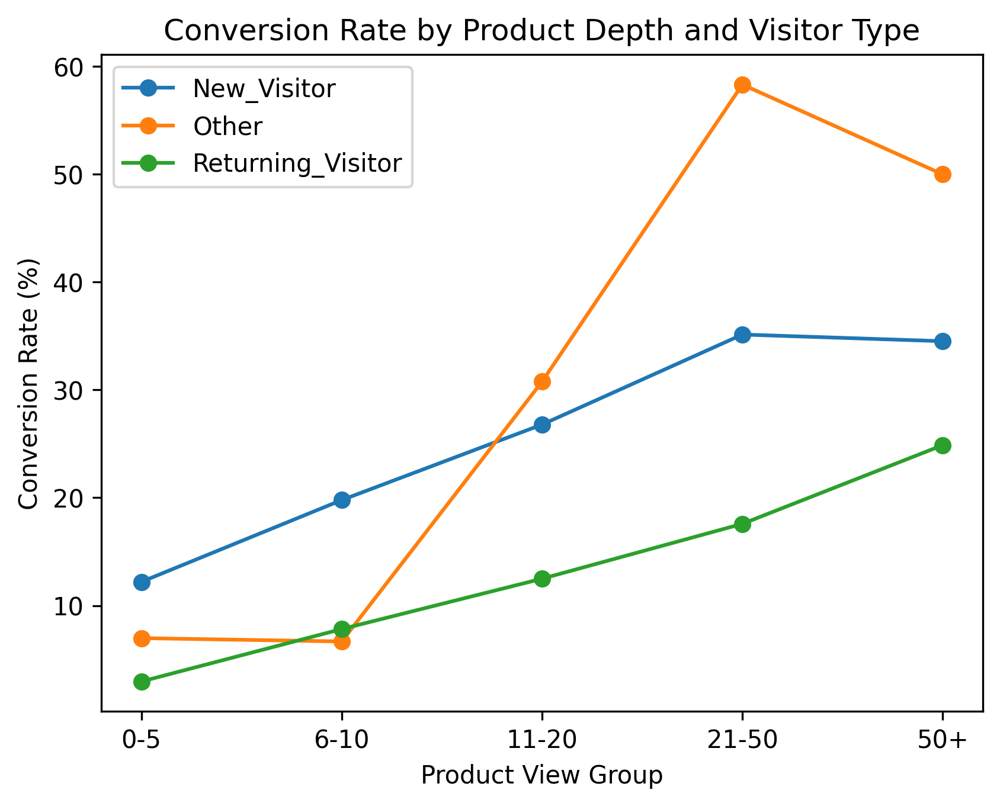
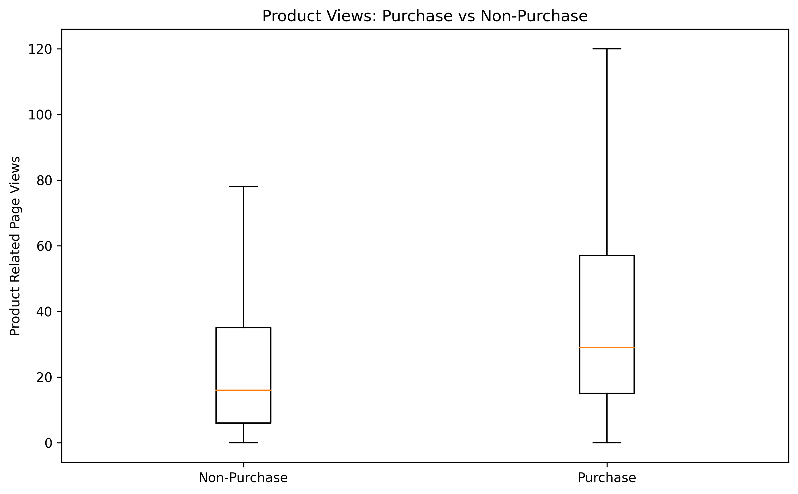
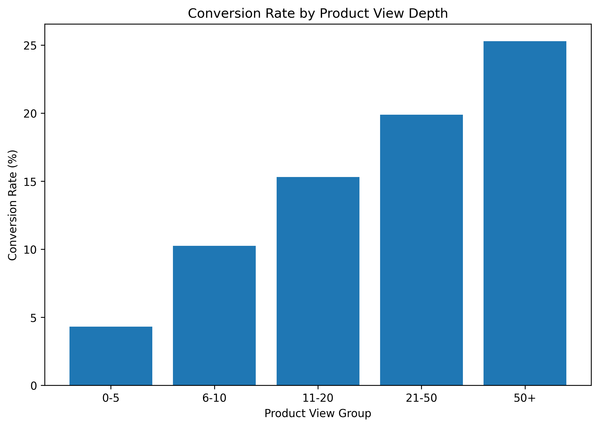
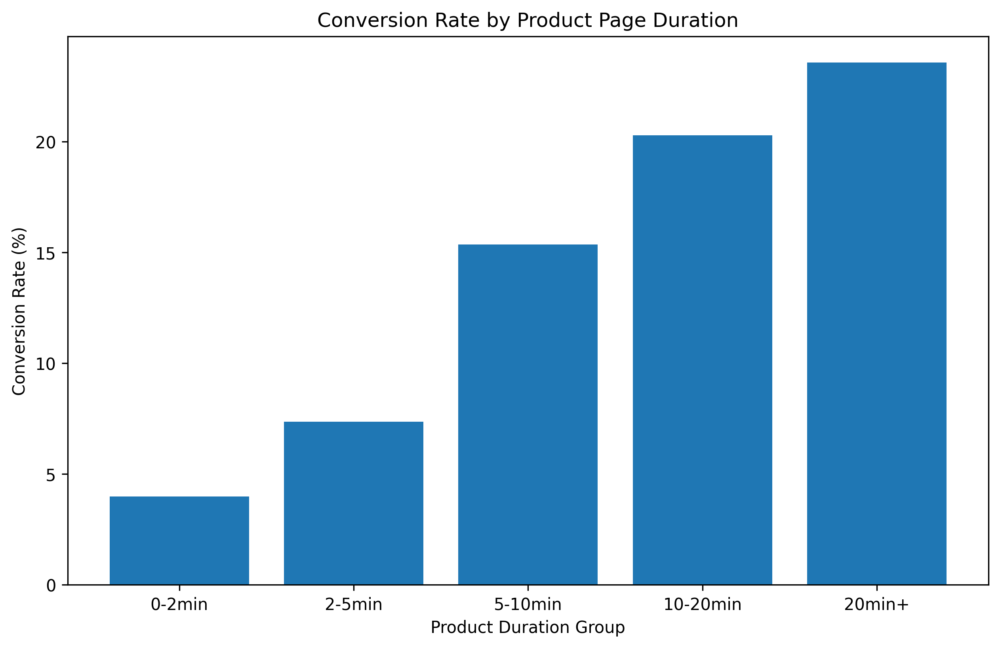
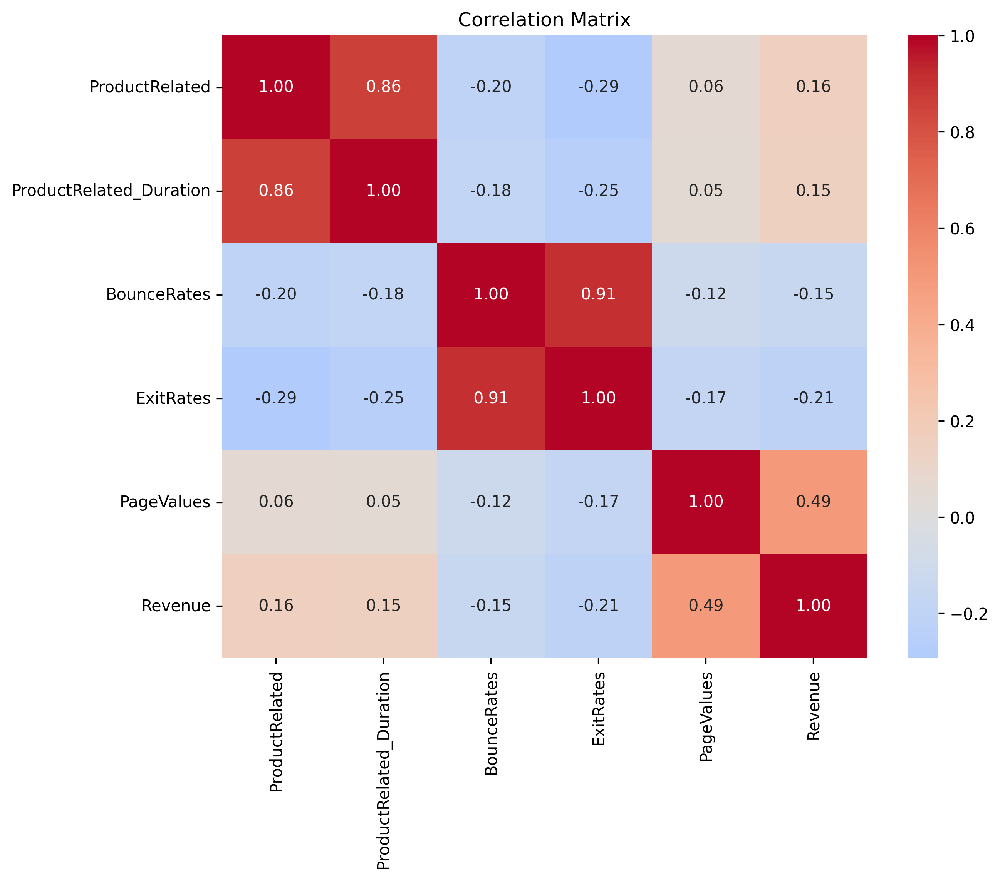
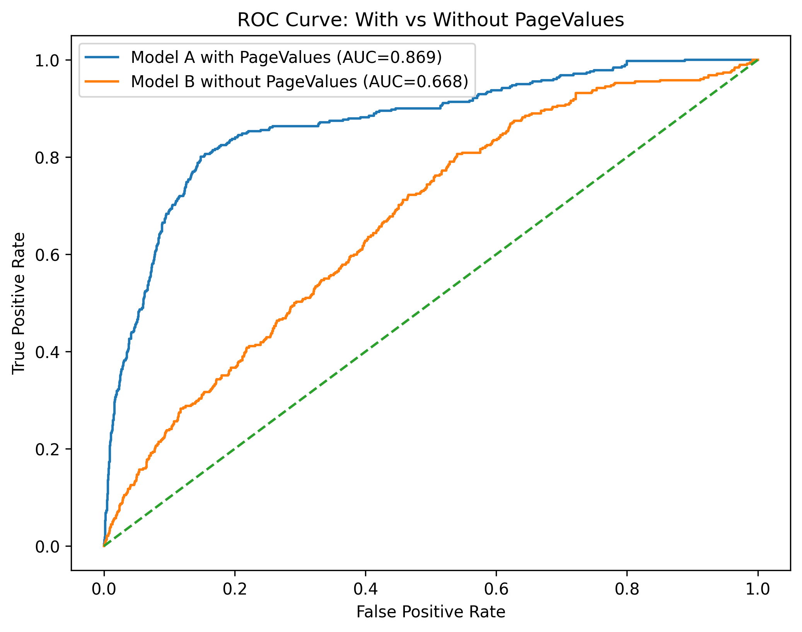
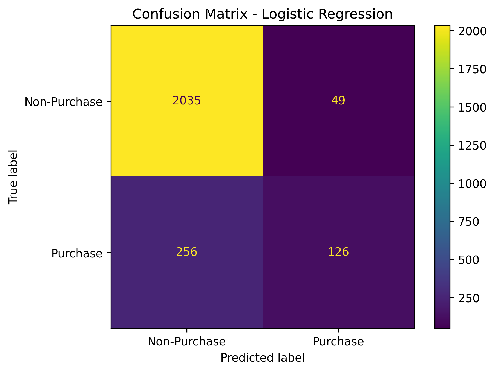
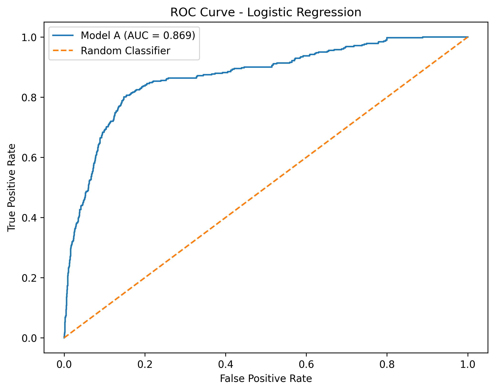
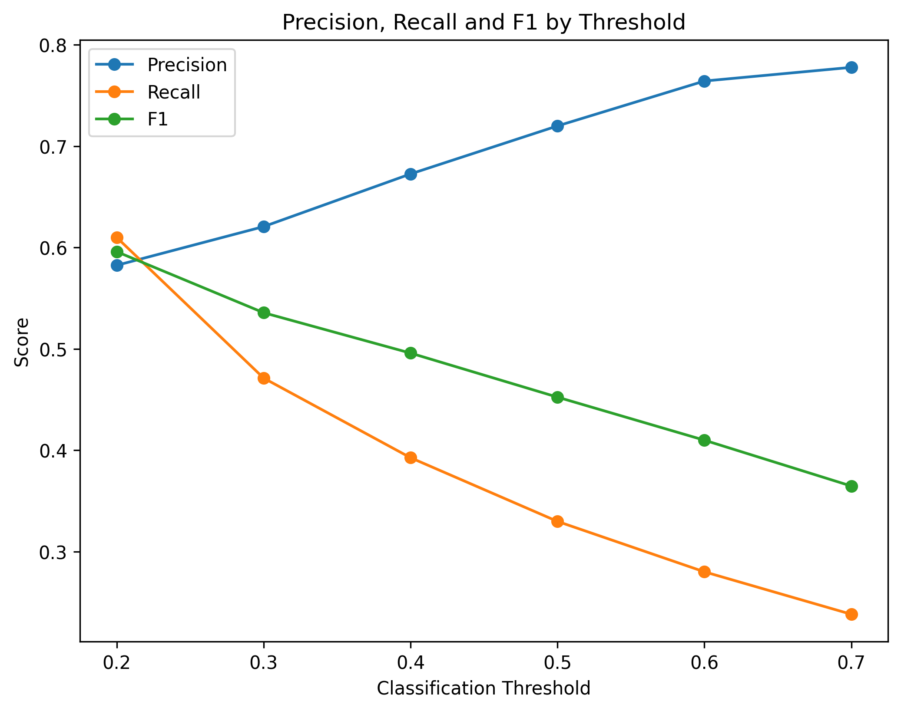
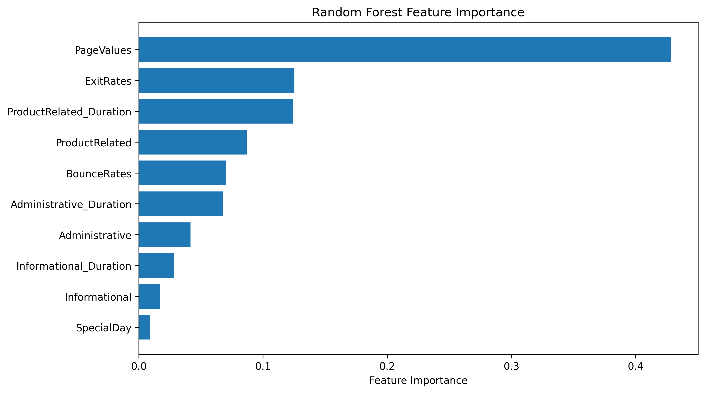

# 电商用户增长与转化分析报告

## 1. 分析背景

SmartBuy平台访问量增长，但购买增长相对不足。
本项目基于用户Session行为数据，分析影响购买转化的潜在因素，
识别关键转化环节与高潜Session，为后续产品、运营和渠道优化提供数据支持。

---

## 2. 核心指标

- Total Sessions
- Purchase Sessions
- Session Conversion Rate

---

## 3. 新老用户相关分析

### 3.1 新老用户分析

#### 分析方法

新用户和老用户为什么转化可能不同？
根据product_views、product_duration、bounce_rate、exit_rate这几个指标综合来看

#### 数据结果

 | VisitorType | session_cnt | purchase_cnt | avg_product_views | avg_product_duration | avg_bounce_rate | avg_exit_rate | conversion_rate | 
 | New_Visitor | 1694 | 422 | 18.054900 | 636.393354 | 0.005261 | 0.020681 | 24.911452 | 
 | Other | 85 | 16 | 12.470588 | 570.404862 | 0.038551 | 0.063349 | 18.823529 | 
 | Returning_Visitor | 10551 | 1470 | 34.082457 | 1289.421490 | 0.024778 | 0.046505 | 13.932329 | 

#### 分析结论

> 根据新老用户的行为结构，我们可以看出促成最后交易的达成，有多方面多维度的原因影响。

---

### 3.2 分析VisitorType

#### 数据结果

拆分VisitorType

 | Returning_Visitor | 95.117845 | 
 | New_Visitor | 4.840067 | 
 | Other | 0.042088 | 
Name: proportion, dtype: float64


 | VisitorType | session_cnt |
 | New_Visitor | 115 |
 | Other | 1 |
 | Returning_Visitor | 2260 |

#### 业务假设

> Returning Visitor➡反复浏览➡行为深➡但未必立即购买
> New Visitor➡浏览相对浅➡但某些进入网站时目的非常明确➡直接完成购买

---

### 3.3 VisitorType × 浏览深度

#### 数据结果

VisitorType	product_view_group	session_cnt	purchase_cnt	conversion_rate
New_Visitor	0-5	328	40	12.195122
New_Visitor	6-10	369	73	19.783198
New_Visitor	11-20	489	131	26.789366
New_Visitor	21-50	424	149	35.141509
New_Visitor	50+	84	29	34.523810
Other	0-5	43	3	6.976744
Other	6-10	15	1	6.666667
Other	11-20	13	4	30.769231
Other	21-50	12	7	58.333333
Other	50+	2	1	50.000000
Returning_Visitor	0-5	1998	59	2.952953
Returning_Visitor	6-10	1420	111	7.816901
Returning_Visitor	11-20	2058	257	12.487852
Returning_Visitor	21-50	3009	529	17.580592
Returning_Visitor	50+	2066	514	24.878993

#### 可视化结果



#### 分析结论

> 同样是50+商品浏览，新用户和老用户CVR仍然不同，而且所有层级New Visitor CVR都高于Returning Visitor，那么说明VisitorType 本身包含额外信息，而不仅是新用户浏览更少。

---

## 4. 商品浏览深度分析

### 4.1 购买 vs 未购买的商品浏览差异

#### 分析方法

根据商品相关页面访问次数和是否购买两个关键词分析浏览差异

关注：

- 购买Session的平均ProductRelated是多少？
- 未购买Session是多少？
- median是否也有差异？

#### 可视化结果



#### 分析结论

> 购买Session表现出更深的商品浏览行为，其平均商品页访问次数为48.21次，明显高于未购买Session的28.71次；中位数同样由16次提升至29次。

---

### 4.2 重新建立商品浏览分层

#### 分析方法

按照商品相关页面访问次数将Session划分为：

- 0-5
- 6-10
- 11-20
- 21-50
- 50+

分别计算各组Session数量、购买Session数量和转化率。

#### 数据结果

| product_view_group | session_cnt | purchase_cnt | conversion_rate |
| 0 | 0-5 | 2369 | 102 | 4.305614 |
| 1 | 6-10 | 1804 | 185 | 10.254989 |
| 2 | 11-20 | 2560 | 392 | 15.312500 |
| 3 | 21-50 | 3445 | 685 | 19.883890 |
| 4 | 50+ | 2152 | 544 | 25.278810 |

#### 可视化结果



#### 分析结论

> 随着商品浏览深度提高，Session购买转化率整体持续提高，商品浏览深度与购买意向存在明显正向关联。

---

## 5. 商品停留时间分析

### 分析方法

按照浏览时间将session划分为：

- 0-2 min
- 2-5 min
- 5-10 min
- 10-20 min
- 20+ min

分别计算各组Session数量、购买Session数量和转化率。

### 数据结果

 | duration_group | session_cnt | purchase_cnt | conversion_rate |
 | 0 | 0-2min | 2361 | 94 | 3.981364 |
 | 1 | 2-5min | 1807 | 133 | 7.360266 |
 | 2 | 5-10min | 2006 | 308 | 15.353938 |
 | 3 | 10-20min | 2376 | 482 | 20.286195 |
 | 4 | 20min+ | 3780 | 891 | 23.571429 |

### 可视化结果



### 分析结论

 > 商品页面停留时长与购买转化呈较稳定的正向关系。从0–2分钟组的3.98%上升至20分钟以上组的23.57%，说明深度浏览行为与购买意向具有较强关联。

### 业务假设

 > 超长停留可能与决策成本、商品比较行为或页面体验有关。

---

## 6. BounceRates分析

### 分析方法

根据Revenue的值分别对应比较BounceRates的mean和median

### 数据结果

 | Revenue | mean | median | 
 | False | 0.025317 | 0.004255 | 
 | True | 0.005117 | 0.000000 | 

### 分析结论

> 购买Session平均BounceRate只有未购买的大约：0.0051 / 0.0253 ≈ 20%

---

## 7. ExitRates分析

### 分析方法

根据Revenue的值分别对应比较ExitRates的mean和median

### 数据结果

 | Revenue | mean | median | 
 | False | 0.047378 | 0.028571 | 
 | True | 0.019555 | 0.016000 | 

### 分析结论

> 未购买Session的退出率整体高于购买Session，退出行为与最终购买结果存在一定关联。

- 购买Session整体表现出更低的跳出率与退出率；尤其未购买Session平均BounceRates约为购买Session的5倍，说明较弱的网站参与行为与未购买结果存在明显关联。

---

## 8. PageValues分析

### 分析方法

根据Revenue的值分别对应比较PageValues的mean和median

### 数据结果

 | Revenue | mean | median |
 | False | 1.975998 | 0.000000 |
 | True | 27.264518 | 16.758134 |

### 分析结论

> 购买和未购买Session是否存在明显差异。页面的价值在推动用户购买商品起到了比较大的作用。

---

## 9. 高潜Session专项分析

### 9.1 基础分析

#### 分析方法

在前面商品浏览深度、停留时间、BounceRates、ExitRates、PageValues分析的基础上，进一步建立高潜Session识别规则。

第一版采用固定阈值：

- 方案A：`ProductRelated >= 30`
- 优点：业务解释简单

随后使用数据分布进行稳健性验证：

- 方案B：`ProductRelated >= P75`
- 优点：阈值由数据分布决定，减少人为设定带来的主观性

实际数据中：

```text
ProductRelated P75 = 38
```

因此正式采用：

```text
高行为深度：ProductRelated >= 38
低行为深度：ProductRelated < 38
```

再结合 `Revenue`，将Session划分为四类：

| session_segment | 定义 | 业务含义 |
|---|---|---|
| High_Value | 高浏览 + 已购买 | 高价值Session |
| High_Potential | 高浏览 + 未购买 | 高参与但未转化Session |
| Low_Activity_Purchase | 低浏览 + 已购买 | 浏览较浅但完成购买 |
| Low_Activity_NonPurchase | 低浏览 + 未购买 | 低参与未购买Session |

#### 数据结果

| session_segment | session_cnt | purchase_cnt | avg_product_views | avg_product_duration | avg_bounce_rate | avg_exit_rate | avg_page_value | session_share |
|---|---:|---:|---:|---:|---:|---:|---:|---:|
| High_Potential | 2376 | 0 | 80.864478 | 2941.962073 | 0.007614 | 0.021814 | 4.182961 | 19.270073 |
| High_Value | 730 | 730 | 96.050685 | 3593.003422 | 0.004543 | 0.015758 | 20.525807 | 5.920519 |
| Low_Activity_NonPurchase | 8046 | 0 | 13.314691 | 517.190040 | 0.030545 | 0.054927 | 1.324277 | 65.255474 |
| Low_Activity_Purchase | 1178 | 1178 | 18.563667 | 812.322111 | 0.005473 | 0.021909 | 31.440460 | 9.553933 |

#### 分析结论

> 使用P75=38作为高浏览阈值后，共识别出2376个High_Potential Session，占全部Session的19.27%。该群体平均浏览80.86个商品页面，平均商品页停留约2942秒，同时BounceRates和ExitRates明显低于低活跃未购买群体。

> 因此High_Potential并不是“进入网站后快速离开的低兴趣Session”，而是已经产生较深浏览行为和较高网站参与度，但最终没有完成购买的一类Session。

---

### 9.2 高潜Session和普通未购买Session比较

#### 分析方法

将 `ProductRelated >= P75 AND Revenue=False` 的高潜Session，与全部未购买Session进行比较，重点观察：

- BounceRates
- ExitRates
- PageValues
- ProductRelated_Duration

#### 数据结果

| Values | high_potential | all_non_purchase | 
| BounceRates | 0.007614 | 0.025317 | 
| ExitRates | 0.021814 | 0.047378 | 
| PageValues | 4.182961 | 1.975998 | 
| ProductRelated_Duration | 2941.962073 | 1069.987809 | 

#### 分析结论

> 高潜Session的平均商品页停留时长约2942秒，即约49分钟，是全部未购买Session约1070秒的2.75倍；其平均PageValues约为普通未购买Session的2.1倍，同时BounceRates和ExitRates明显更低。

> 这说明该群体并非低兴趣或快速流失用户，而是已经表现出较强网站参与度但最终未完成购买的一类Session。

#### 业务假设

> 高潜Session并不存在明显的早期流失特征，因此“不购买”的问题更可能发生在较深层的决策环节。

> 但当前数据不包含加购、结算、支付、优惠券、价格变化等更细粒度事件，因此不能直接判断具体未购买原因。

---

### 9.3 高潜Session的月份结构

#### 分析方法

仅比较高潜Session绝对数量容易受到月份总体流量影响，因此进一步计算：

```text
High Potential Rate = 该月高潜未购买Session / 该月全部未购买Session
```

#### 数据结果

| Month | session_cnt |
| 7	Nov | 690 |
| 6	May | 626 |
| 1	Dec | 343 |
| 5	Mar | 212 |
| 0	Aug | 118 |
| 8	Oct | 111 |
| 3	Jul | 97 |
| 9	Sep | 94 |
| 4	June | 77 |
| 2	Feb | 8 |


| Month | session_cnt | non_purchase_cnt | high_potential_rate |
|---|---:|---:|---:|
| Aug | 118 | 357 | 33.053221 |
| Nov | 690 | 2238 | 30.831099 |
| June | 77 | 259 | 29.729730 |
| Jul | 97 | 366 | 26.502732 |
| Sep | 94 | 362 | 25.966851 |
| Oct | 111 | 434 | 25.576037 |
| Dec | 343 | 1511 | 22.700199 |
| May | 626 | 2999 | 20.873625 |
| Mar | 212 | 1715 | 12.361516 |
| Feb | 8 | 181 | 4.419890 |

#### 分析结论

> November的高潜未购买Session绝对数量最多，为690个；但从比例来看，August的高潜率最高，为33.05%。

> 因此月份分析需要同时观察“高潜规模”和“高潜率”：November更像是高潜未转化规模较大的月份，而August更像是高潜未转化占比较高的月份。

---

### 9.4 渠道 × 高潜率

```text
渠道高潜率 = 该渠道高潜未购买Session / 该渠道全部未购买Session
```

#### 数据结果

| TrafficType | high_potential_cnt | non_purchase_cnt | high_potential_rate |
|---:|---:|---:|---:|
| 2 | 852 | 3066 | 27.788650 |
| 19 | 4 | 16 | 25.000000 |
| 6 | 96 | 391 | 24.552430 |
| 13 | 168 | 695 | 24.172662 |
| 1 | 512 | 2189 | 23.389676 |
| 4 | 210 | 904 | 23.230088 |
| 7 | 6 | 28 | 21.428571 |
| 10 | 73 | 360 | 20.277778 |
| 3 | 345 | 1872 | 18.429487 |
| 14 | 2 | 11 | 18.181818 |
| 11 | 34 | 200 | 17.000000 |
| 8 | 31 | 248 | 12.500000 |
| 15 | 4 | 38 | 10.526316 |
| 5 | 21 | 204 | 10.294118 |
| 18 | 1 | 10 | 10.000000 |
| 20 | 14 | 148 | 9.459459 |
| 9 | 3 | 38 | 7.894737 |

#### 分析结论

> TrafficType 2同时具有较大的高潜Session规模和较高的高潜率，是后续渠道分析中比较值得关注的渠道。

> 对TrafficType 19等样本量较小的渠道，即使高潜率较高，也不能仅根据比例直接判断渠道质量，需要结合样本规模共同分析

---

### 9.5 建立预测型高潜Session

#### 分析方法

规则法只使用商品浏览深度识别高潜：

```text
Rule-based
ProductRelated >= 38
AND
Revenue = False
```

进一步利用Logistic Regression生成每个Session的 `purchase_probability`，再根据概率分布确定模型高潜阈值。

购买倾向评分分布：

```text
count    12330.000000
mean         0.347065
std          0.263930
min          0.003702
50%          0.281559
75%          0.400688
90%          0.833762
95%          0.977795
max          1.000000
```

没有直接主观使用0.7，而是采用P90：

```text
P90 = 0.833762
```

模型法定义：

```text
Model-based High Potential
PurchaseProbability >= P90
AND
Revenue = False
```

即：模型购买倾向进入全部Session的Top 10%，但实际没有购买。

#### 数据结果

```text
规则法高潜数量：2376
模型法高潜数量：356
重合数量：188
规则法被模型覆盖率：7.91%
模型法被规则覆盖率：52.81%
Jaccard：7.39%
```

两种方法形成三个重点群体：

```text
                    模型高潜
                  是        否
               ┌────────┬─────────┐
规则高潜   是   │  188   │  2188   │
               │ Both   │Rule Only│
               ├────────┼─────────┤
          否   │  168   │         │
               │Model   │         │
               │ Only   │         │
               └────────┴─────────┘
```

#### 分析结论

> 模型法明显比规则法更加严格。规则法识别的是“高浏览未购买Session”，模型法识别的是“综合行为特征下购买倾向进入Top 10%，但最终未购买的Session”。

> 模型高潜中52.81%同时满足高浏览规则，说明商品浏览深度是高购买倾向的重要信号之一，但并不是唯一信号。

> 规则高潜中只有7.91%同时进入模型高潜范围，说明“浏览很多”不能直接等同于“综合购买倾向很高”。

---

### 9.6 Rule Only / Model Only / Both 人群画像

#### 数据结果

| 指标 | Rule Only | Model Only | Both |
|---|---:|---:|---:|
| Session数量 | 2188 | 168 | 188 |
| ProductRelated | 76.574040 | 23.339286 | 130.797872 |
| ProductRelated_Duration | 2739.787629 | 1075.106445 | 5294.928476 |
| BounceRates | 0.007928 | 0.008149 | 0.003961 |
| ExitRates | 0.022398 | 0.022218 | 0.015017 |
| PageValues | 1.701156 | 43.220762 | 33.066957 |
| PurchaseProbability | 0.410801 | 0.946344 | 0.934742 |

#### 分析结论

**Rule Only：2188个**

> 平均浏览76.57个商品页面、商品页停留约2739.79秒，但PageValues仅为1.70，模型购买倾向约0.411。说明高浏览更适合解释为“高参与”，不能直接解释为“高购买倾向”。

**Model Only：168个**

> 平均只浏览23.34个商品页面，没有达到P75=38，但PageValues达到43.22，模型购买倾向约0.946。说明模型能够识别单一浏览阈值无法覆盖的高购买倾向Session。

**Both：188个**

> 平均浏览130.80个商品页面，平均商品页停留5294.93秒，约88.2分钟，同时BounceRates和ExitRates最低，PageValues达到33.07，模型购买倾向约0.935，但最终仍然没有购买。

> 因此Both群体可以定义为当前数据条件下的Core High Potential Sessions，是最值得优先分析和运营关注的一批Session。

---

## 10. 相关性分析

### 分析方法

选择以下核心行为变量分析与Revenue之间的线性相关性：

- ProductRelated
- ProductRelated_Duration
- BounceRates
- ExitRates
- PageValues
- Revenue

### 数据结果

| \ | ProductRelated | ProductRelated_Duration | BounceRates | ExitRates | PageValues | Revenue |
|---|---:|---:|---:|---:|---:|---:|
| ProductRelated | 1.000000 | 0.860927 | -0.204578 | -0.292526 | 0.056282 | 0.158538 |
| ProductRelated_Duration | 0.860927 | 1.000000 | -0.184541 | -0.251984 | 0.052823 | 0.152373 |
| BounceRates | -0.204578 | -0.184541 | 1.000000 | 0.913004 | -0.119386 | -0.150673 |
| ExitRates | -0.292526 | -0.251984 | 0.913004 | 1.000000 | -0.174498 | -0.207071 |
| PageValues | 0.056282 | 0.052823 | -0.119386 | -0.174498 | 1.000000 | 0.492569 |
| Revenue | 0.158538 | 0.152373 | -0.150673 | -0.207071 | 0.492569 | 1.000000 |

按Revenue相关性排序：

| Feature | Correlation with Revenue |
|---|---:|
| PageValues | 0.492569 |
| ProductRelated | 0.158538 |
| ProductRelated_Duration | 0.152373 |
| BounceRates | -0.150673 |
| ExitRates | -0.207071 |

### 可视化结果



### 分析结论

> PageValues与购买结果的线性相关性明显强于其他几个行为变量，是当前数据中最值得关注的购买相关指标。

> ProductRelated和ProductRelated_Duration与Revenue呈弱正相关；BounceRates和ExitRates与Revenue呈负相关。

> 相关性只能说明变量之间存在统计关联，不能直接解释为因果关系。

---

## 11. 第一个模型：Logistic Regression

### 11.1 模型目的

前面的规则型高潜识别只使用ProductRelated一个变量，而购买行为可能同时受到多个行为变量影响，因此建立Logistic Regression作为购买预测Baseline。

使用特征：

```text
Administrative
Administrative_Duration
Informational
Informational_Duration
ProductRelated
ProductRelated_Duration
BounceRates
ExitRates
PageValues
SpecialDay
```

目标变量：

```text
Revenue
```

训练集和测试集按照80% / 20%划分，并使用 `stratify=y` 保持购买比例基本一致。

### 11.2 第一版模型结果

使用 `StandardScaler + LogisticRegression(class_weight="balanced")`。

```text
              precision    recall  f1-score   support

           0       0.94      0.89      0.91      2084
           1       0.54      0.70      0.61       382

    accuracy                           0.86      2466
   macro avg       0.74      0.79      0.76      2466
weighted avg       0.88      0.86      0.87      2466
```

Confusion Matrix：

```text
[[1853  231]
 [ 116  266]]
```

ROC-AUC：

```text
0.8647
```

#### 分析结论

> 第一版Logistic Regression具有较好的整体区分能力，ROC-AUC约为0.865。通过class_weight="balanced"后，购买类Recall达到约70%，能够识别更多真实购买Session。

> 如果业务目标是寻找尽可能多的潜在购买Session，Recall非常重要；但Recall也不能无限提高，否则会把大量低意向Session判断为购买，增加运营触达成本，因此需要平衡Precision和Recall。

---

### 11.3 PageValues A/B实验

#### 分析方法

为了验证PageValues对模型预测能力的影响，建立控制变量实验：

- Model A：使用全部features，包含PageValues
- Model B：使用相同features，但删除PageValues
- 两个模型使用同一批训练和测试样本
- 使用相同算法和参数
- 对比Accuracy、Precision、Recall、F1、ROC-AUC

#### 数据结果

| Model | Accuracy | Precision | Recall | F1 | ROC-AUC |
|---|---:|---:|---:|---:|---:|
| Model A (with PageValues) | 0.876318 | 0.7200 | 0.329843 | 0.452424 | 0.869497 |
| Model B (without PageValues) | 0.844282 | 0.4375 | 0.018325 | 0.035176 | 0.667891 |

```text
Model A ROC-AUC: 0.8695
Model B ROC-AUC: 0.6679
ROC-AUC Difference: 0.2016
```

#### 可视化结果



#### 分析结论

> 加入PageValues后，模型ROC-AUC从0.6679提高到0.8695，提升约0.2016；购买类Recall从1.83%提高到32.98%，F1从0.035提高到0.452。

> 这说明PageValues是当前模型区分购买与未购买Session的重要变量，模型预测能力对PageValues存在明显依赖。

> 在实际业务落地时，需要进一步确认PageValues在预测发生的时间点是否已经可获得，避免把事后才能完整计算的指标直接用于实时预测。

---

### 11.4 Confusion Matrix 与 ROC Curve

#### Confusion Matrix

四种结果分别表示：

```text
TN：实际没买，模型也预测没买
FP：实际没买，模型预测会买
FN：实际买了，模型却预测不买
TP：实际买了，模型也预测会买
```

重点关注FN，因为FN越多，意味着漏掉的真实购买Session越多。

#### 可视化结果



#### ROC Curve

Model A的ROC曲线明显高于随机分类基准线，ROC-AUC约为0.869，说明模型对购买与未购买Session具有较好的整体区分能力。



> ROC-AUC反映模型整体的排序和区分能力，而Recall取决于最终选择的分类阈值，因此ROC-AUC较高和默认阈值下Recall较低并不矛盾。

---

### 11.5 Threshold Tuning

#### 分析方法

Logistic Regression默认以约0.5作为分类阈值，但业务场景中并不一定必须使用0.5，因此测试不同Threshold对Precision、Recall和F1的影响。

#### 数据结果

| Threshold | Precision | Recall | F1 |
|---:|---:|---:|---:|
| 0.2 | 0.582500 | 0.609948 | 0.595908 |
| 0.3 | 0.620690 | 0.471204 | 0.535714 |
| 0.4 | 0.672646 | 0.392670 | 0.495868 |
| 0.5 | 0.720000 | 0.329843 | 0.452424 |
| 0.6 | 0.764286 | 0.280105 | 0.409962 |
| 0.7 | 0.777778 | 0.238220 | 0.364729 |

#### 可视化结果



#### 分析结论

> 随着分类阈值提高，Precision持续上升，而Recall持续下降，体现了典型的Precision-Recall Trade-off。

> 在当前测试的候选阈值中，Threshold=0.2取得最高F1=0.5959；相比默认0.5，Recall从32.98%提升到60.99%，但Precision从72.00%下降到58.25%。

> 如果业务采用Email、Push、站内推荐等低成本触达，可以考虑降低分类阈值以提高潜在人群覆盖；如果触达成本较高，则应提高阈值、更关注Precision。

> 分类Threshold与前面P90高潜阈值不是同一个概念：分类阈值用于将概率转换为Purchase/Non-Purchase，高潜P90用于从实际未购买Session中筛选最值得运营关注的Top 10%。

---

## 12. 第二个模型：Random Forest

### 分析方法

Logistic Regression结构简单、可解释性较强，适合作为Baseline；Random Forest能够进一步捕捉非线性关系和变量交互，因此作为第二个模型进行验证。

### 数据结果

```text
              precision    recall  f1-score   support

           0       0.92      0.97      0.94      2084
           1       0.73      0.52      0.61       382

    accuracy                           0.90      2466
   macro avg       0.82      0.74      0.77      2466
weighted avg       0.89      0.90      0.89      2466
```

```text
ROC-AUC: 0.8887503642813356
```

### 分析结论

> Random Forest的ROC-AUC约为0.889，高于Logistic Regression约0.869，说明非线性关系和变量交互能够提供一定额外预测能力。

> 两个模型的定位不同：Logistic Regression适合作为简单、可解释的Baseline；Random Forest用于补充验证非线性关系和变量交互。

---

### 12.1 Feature Importance

#### 数据结果

| feature | importance |
|---|---:|
| PageValues | 0.428823 |
| ExitRates | 0.125333 |
| ProductRelated_Duration | 0.124438 |
| ProductRelated | 0.086943 |
| BounceRates | 0.070360 |
| Administrative_Duration | 0.067771 |
| Administrative | 0.041570 |
| Informational_Duration | 0.028200 |
| Informational | 0.017164 |
| SpecialDay | 0.009397 |

#### 可视化结果



#### 分析结论

> Random Forest中PageValues的重要性达到0.4288，明显高于其他变量，再次验证了PageValues是当前数据中最核心的购买预测信号之一。

> ExitRates、ProductRelated_Duration、ProductRelated、BounceRates也提供了一定预测信息。

> 这一结果与前面的相关性分析和Logistic Regression A/B实验形成一致证据链：EDA发现PageValues与Revenue相关性最强；删除PageValues后模型性能明显下降；Random Forest中PageValues的重要性再次排名第一。

---

## 12. 核心结论

> 第一，商品浏览深度能够有效识别高参与Session，但不能单独代表高购买倾向。P75规则识别出2376个高浏览未购买Session，但其中只有188个同时进入模型Top 10%高潜范围。

> 第二，高潜Session表现出显著更深的浏览行为：商品页平均停留时长约49分钟，是整体未购买Session的约2.75倍；其平均PageValues约为普通未购买Session的2.1倍，同时BounceRates和ExitRates明显更低。这说明该群体并非低兴趣或快速流失Session，而是已经表现出较强网站参与度但最终未完成购买的一类Session。

> 第三，PageValues是当前模型最重要的预测信号之一。加入PageValues后Logistic Regression ROC-AUC从0.6679提高至0.8695，提升约0.2016；Random Forest中PageValues Feature Importance同样排名第一，为0.4288。

> 第四，模型能够补充单一浏览规则无法识别的高潜Session。Model Only共168个，平均商品浏览只有23.34次，但PageValues达到43.22，模型购买倾向约0.946。

> 第五，两种方法共同识别的188个Both Session是当前数据下最值得关注的Core High Potential Sessions。该群体平均浏览130.80个商品页面，平均商品页停留约88.2分钟，同时BounceRates和ExitRates最低、PageValues较高、模型购买倾向约0.935，但最终仍未购买。

> 第六，模型分类阈值需要服务于业务目标，而不能机械使用默认0.5。在当前测试阈值中，0.2取得最高F1，并将Recall从32.98%提高到60.99%，适合用于讨论低成本触达场景下覆盖更多潜在购买Session的策略。

> 第七，所有分析结果仍然是相关性和预测关系，不能直接解释为因果关系。当前数据也缺少购物车、结算、支付、价格、优惠等事件，因此能够识别“谁值得关注”，但不能直接证明“为什么最终没有购买”。

---

## 13. 业务建议

### 13.1 建立三级未购买Session运营体系

根据规则法和模型法的交叉结果，将未购买Session划分为不同运营优先级：

| 优先级 | 人群 | 数量 | 建议 |
|---|---|---:|---|
| P1 | Core High Potential / Both | 188 | 优先分析转化阻碍，重点触达 |
| P2 | Model Only | 168 | 模型高意向群体，进行精准触达 |
| P3 | Rule Only | 2188 | 高参与但购买信号相对较弱，采用低成本运营或继续观察 |

> 不应把所有“浏览很多但没有购买”的Session视为同样高价值，而应结合多维行为特征进一步区分运营优先级。

### 13.2 优先研究Core High Potential的转化阻碍

Both群体已经表现出：

```text
极深商品浏览
+
超长停留
+
低BounceRates
+
低ExitRates
+
高PageValues
+
高模型购买倾向
+
最终未购买
```

因此这188个Session是当前最值得继续分析的人群。

后续如果能够获得更加完整的业务数据，建议重点补充：

- Add to Cart
- Checkout
- Payment
- Coupon / Promotion
- Price
- Inventory
- Product / Category

通过事件级漏斗进一步定位真正的流失环节。

### 13.3 月份和渠道同时关注规模与比例

月份和渠道效果不能只看高潜数量，也不能只看高潜率。

建议同时关注：

```text
High Potential Volume
+
High Potential Rate
+
触达成本
+
预期转化收益
```

例如：

- November高潜Session数量较大；
- August高潜率较高；
- TrafficType 2同时具有较大的高潜规模和较高高潜率。

这些维度可以用于后续运营资源优先级排序。

### 13.4 根据营销成本选择模型分类阈值

如果运营方式为低成本Email、Push、站内推荐，可以适当降低分类阈值，提高Recall，覆盖更多潜在购买Session。

如果运营方式涉及高成本优惠券、人工销售或其他高投入触达，则应提高分类阈值，更重视Precision，减少无效触达。

### 13.5 分析局限性

- 当前数据粒度是Session，不是独立User，因此2376个高潜Session不等于2376个独立用户。
- PageValues对模型贡献很大，实际部署前需要确认该字段在预测时点是否可获取。
- `predict_proba()`更适合作为购买倾向评分，不应直接解释为真实购买概率，当前模型没有进行概率校准。
- 当前最终购买倾向评分中包含训练样本自身打分，作为项目业务评分演示可以使用；更严格的生产环境应使用独立Holdout或Out-of-Fold Prediction。
- 当前数据能够识别高参与、高购买倾向但未购买的Session，但无法直接确定是价格、支付、库存、物流、页面体验还是其他原因导致最终未购买。

